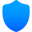

<h1 align="center">
 

 
NextDNS Device Identifier
</h1>

This is only tutorial you need to make those unidentified devices became visible and also you can add custom names to them
 

 
<h2 align="left">
 Project related benchmarks
</h2>

 
 ![License](https://img.shields.io/badge/CC4.0-License?style=for-the-badge&logo=data%3Aimage%2Fsvg%2Bxml%3Bbase64%2CPD94bWwgdmVyc2lvbj0iMS4wIiBlbmNvZGluZz0iaXNvLTg4NTktMSI%2FPg0KPCEtLSBVcGxvYWRlZCB0bzogU1ZHIFJlcG8sIHd3dy5zdmdyZXBvLmNvbSwgR2VuZXJhdG9yOiBTVkcgUmVwbyBNaXhlciBUb29scyAtLT4NCjxzdmcgZmlsbD0iIzAwMDAwMCIgaGVpZ2h0PSI4MDBweCIgd2lkdGg9IjgwMHB4IiB2ZXJzaW9uPSIxLjEiIGlkPSJMYXllcl8xIiB4bWxucz0iaHR0cDovL3d3dy53My5vcmcvMjAwMC9zdmciIHhtbG5zOnhsaW5rPSJodHRwOi8vd3d3LnczLm9yZy8xOTk5L3hsaW5rIiANCgkgdmlld0JveD0iMCAwIDMwNS40MDYgMzA1LjQwNiIgeG1sOnNwYWNlPSJwcmVzZXJ2ZSI%2BDQo8Zz4NCgk8Zz4NCgkJPGc%2BDQoJCQk8cGF0aCBkPSJNNzcuMjAyLDEyNy44ODhjMCw0Ljk3MSw0LjAyOSw5LDksOWgxMzAuNTc1YzQuOTcxLDAsOS00LjAyOSw5LTlzLTQuMDI5LTktOS05SDg2LjIwMg0KCQkJCUM4MS4yMzEsMTE4Ljg4OCw3Ny4yMDIsMTIyLjkxNyw3Ny4yMDIsMTI3Ljg4OHoiLz4NCgkJCTxwYXRoIGQ9Ik04Ni4yMDIsMTY4LjUzOGgxMzAuNTc1YzQuOTcxLDAsOS00LjAyOSw5LTljMC00Ljk3MS00LjAyOS05LTktOUg4Ni4yMDJjLTQuOTcxLDAtOSw0LjAyOS05LDkNCgkJCQlDNzcuMjAyLDE2NC41MDksODEuMjMxLDE2OC41MzgsODYuMjAyLDE2OC41Mzh6Ii8%2BDQoJCQk8cGF0aCBkPSJNODYuMjAyLDYwLjUzOGg0NC4zNDFjNC45NzEsMCw5LTQuMDI5LDktOWMwLTQuOTcxLTQuMDI5LTktOS05SDg2LjIwMmMtNC45NzEsMC05LDQuMDI5LTksOQ0KCQkJCUM3Ny4yMDIsNTYuNTA5LDgxLjIzMSw2MC41MzgsODYuMjAyLDYwLjUzOHoiLz4NCgkJCTxwYXRoIGQ9Ik0xNDkuNTAzLDI0Mi4zNzRIODYuMjAyYy00Ljk3MSwwLTksNC4wMjktOSw5YzAsNC45NzEsNC4wMjksOSw5LDloNjMuMzAxYzQuOTcxLDAsOS00LjAyOSw5LTkNCgkJCQlTMTU0LjQ3NCwyNDIuMzc0LDE0OS41MDMsMjQyLjM3NHoiLz4NCgkJCTxwYXRoIGQ9Ik0xNDkuNTAzLDIxNC41MTJIODYuMjAyYy00Ljk3MSwwLTksNC4wMjktOSw5YzAsNC45NzEsNC4wMjksOSw5LDloNjMuMzAxYzQuOTcxLDAsOS00LjAyOSw5LTkNCgkJCQlDMTU4LjUwMywyMTguNTQxLDE1NC40NzQsMjE0LjUxMiwxNDkuNTAzLDIxNC41MTJ6Ii8%2BDQoJCQk8cGF0aCBkPSJNMjY3LjA2Nyw3MC42MTNMMTk5LjA5MSwyLjYzNkMxOTcuNDAyLDAuOTQ4LDE5NS4xMTMsMCwxOTIuNzI3LDBINDQuNzAzYy00Ljk3MSwwLTksNC4wMjktOSw5djI4Ny40MDYNCgkJCQljMCw0Ljk3MSw0LjAyOSw5LDksOWgyMTZjNC45NzEsMCw5LTQuMDI5LDktOVY3Ni45NzdDMjY5LjcwMyw3NC41OSwyNjguNzU1LDcyLjMwMSwyNjcuMDY3LDcwLjYxM3ogTTE5OS43MjcsMjguNzI4DQoJCQkJbDQxLjI0OSw0MS4yNDloLTQxLjI0OVYyOC43Mjh6IE0yNTEuNzAzLDI4Ny40MDZoLTE5OFYxOGgxMjguMDIzdjYwLjk3N2MwLDQuOTcxLDQuMDI5LDksOSw5aDYwLjk3N1YyODcuNDA2eiIvPg0KCQkJPHBhdGggZD0iTTE5OS45NzYsMjA4LjUxMmMtMTYuMDc4LDAtMjkuMTU4LDEzLjA4MS0yOS4xNTgsMjkuMTU5czEzLjA4LDI5LjE1OCwyOS4xNTgsMjkuMTU4czI5LjE1OC0xMy4wOCwyOS4xNTgtMjkuMTU4DQoJCQkJUzIxNi4wNTQsMjA4LjUxMiwxOTkuOTc2LDIwOC41MTJ6IE0xOTkuOTc2LDI0OC44MjljLTYuMTUyLDAtMTEuMTU4LTUuMDA1LTExLjE1OC0xMS4xNThjMC02LjE1Myw1LjAwNi0xMS4xNTksMTEuMTU4LTExLjE1OQ0KCQkJCWM2LjE1MiwwLDExLjE1OCw1LjAwNiwxMS4xNTgsMTEuMTU5QzIxMS4xMzQsMjQzLjgyNCwyMDYuMTI4LDI0OC44MjksMTk5Ljk3NiwyNDguODI5eiIvPg0KCQk8L2c%2BDQoJPC9nPg0KPC9nPg0KPC9zdmc%2B&logoColor=red&label=License&labelColor=light%20brown&color=purple&link=https%3A%2F%2Fgithub.com%2Fmrdarksidetm%2FNextdns-Device-ID-Setup%2Fblob%2F1f3512177f2d5433f1fd9d54bb30d1cebd6c2cf9%2FLICENSE)
 
 
 

 
<h2 align="left">
Platform Supported ⚙️
</h2>

 
 
 

# Nextdns-Device-ID-Setup
Instead of "Unnamed devices" filled in your Dashboard you can make those devices recognizable
